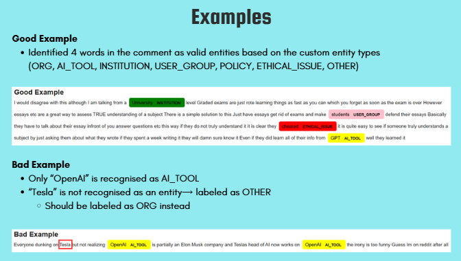

# NLP Group Project (NER sklearn-crfsuite model)
The group project was to analyze the public opinions on the ethicality of Artificial Intelligence (AI) uses in academic settings using Text Mining and Natural Language Processing (NLP) techniques from classroom learning.

## Problem Statement (Understanding AI Ethical Dilemmas in Academic Settings)
AI is transforming education by enhancing learning, research, and academic tasks through tools like ChatGPT and DeepSeek. While AI offers benefits, it also raises ethical concerns regarding academic integrity, fairness, over-reliance, plagiarism, misinformation, and biased responses.

This project analyzes the public opinions on the ethicality of AI uses in academic settings:

- Who are the key players in identifying the ethicality of AI
- What are the relevant themes within comments
- How do people feel in regards to the AI ethical dilemma
- What are some (root) causes identified within the comments

## Solution

  ## Project Contributions
- Train Named Entity Recognition (NER) model using Python sklearn-crfsuite library
- Use ChatGPT to label gold truth data
- Evaluation of CRF model using precision, recall and F1-score
- Visualise results using entity frequency bar and pie chart
- Display good and bad text snippet example using Spacy Dispacy Entity Visualizer

  ## What Worked Well
The use of the scikit-learn library’s CRFsuite model allowed for flexibility in feature selection and hyperparameter tuning. We can include handcrafted features easily, giving more control compared to other approaches such as deep learning black-box models. It allows for L1 and L2 regularization parameter tuning which we set both to 0.1 to help with generalization and prevention of model overfitting. Additionally, CRFsuite works well with CPUs. Thus, it is less computationally intensive and the model provides fast training and prediction.

## **What Didn’t Work Well**
1. There are no pre-trained NER models with entity types that suited the project context. The pre-trained models contain default entities such as PERSON, LOCATION, DATE which were not relevant to the use of AI in academics.
2. The CRF model using scikit-learn required significant manual feature engineering to experiment to get the best performance. The process was time-consuming and complex.
3. The dictionary used as input for ChatGPT to label the gold truth was derived from the training dataset. This meant that there was a fixed vocabulary. Texts often evolve with new words, phrases or abbreviations, and the dictionary-based approach cannot capture these dynamically. Another limitation is the lack of variability. The dictionary might not include synonyms or other linguistic nuances that are important for accurate classification of words as named entities. For example, under POLICY entity type, “rules” have similar meaning to “policy” but it was not in the dictionary as it did not appear in the training dataset.

## Gap Analysis
The current model uses CRF which requires custom feature extraction. Advanced feature engineering tools such as BERT-based embeddings that help to automate the process could improve the model performance and scale up the training of the model for future larger size datasets as more people post about their views on AI in academics in Reddit and AI tools like ChatGPT matures over time.

## **Future Work**
Try out Hybrid approach (BiLSTM-CRF) to predict the entity types. BiLSTM captures bidirectional context and CRF improves sequence labeling accuracy
- Handles complex language structures well
